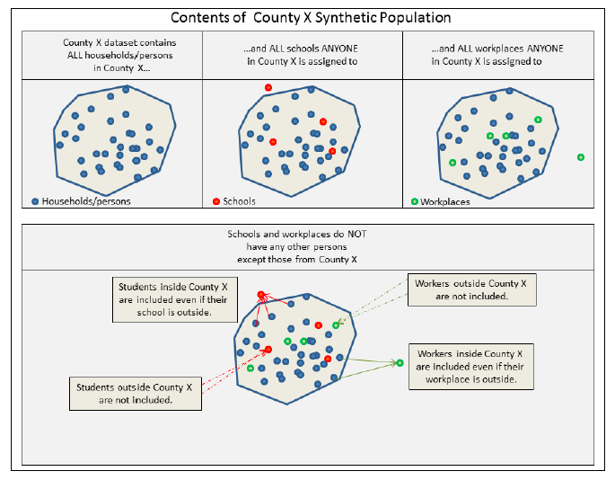
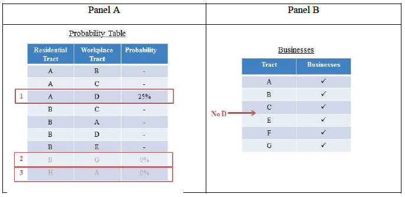

# U.S. Synthetic Population Database 2010: Quick Start Guide (README)

Apr, 2024

Prepared by
RTI International
3040 Cornwallis Road
Research Triangle Park, NC 27709

[Original PDF Format](https://github.com/RTIInternational/SyntheticPopulations/blob/main/assets/2010_SynthPop_Quick_Start_Guide.pdf)

This work was supported by the Models of Infectious Disease Agency Study (MIDAS) from the National Institute of General Medical Sciences (NIGMS), grant number U24GM087704. The content is solely the responsibility of the authors and does not necessarily represent the official views of the NIGMS or the National Institutes of Health.

# Table of Contents
**Contents**

[Overview and Introduction](#overview-and-introduction)

[Downloading and Processing](#downloading-and-processing)

[Data Identification and Metadata](#data-identification-and-metadata)

[Citing the U.S. Synthetic Population Database](#citing-the-us-synthetic-population-database)

[Data Sources](#data-sources)

[Data Files Contained in Each Synthesized Dataset](#data-files-contained-in-each-synthesized-dataset)

[Geographic Contents of Each Synthesized Dataset](#geographic-contents-of-each-synthesized-dataset)

[Generating Synthesized Households](#generating-synthesized-households)

[Group Quarters and Group Quarters Residents](#group-quarters-and-group-quarters-residents)

[School Assignments](#school-assignments)

[Workplace Assignments](#workplace-assignments)

[Household Spatial Distributions](#household-spatial-distributions)

[Data Quality Measurements](#data-quality-measurements)

[Latitude/Longitude Coordinate System](#latitudelongitude-coordinate-system)

[Data Relationships](#data-relationships)

[Important Notes](#important-notes)

[References](#references)

[Appendix A: Data Dictionary](#appendix-a-data-dictionary)

[Appendix B: Codes](#appendix-b-codes)

[Appendix C: Metadata File Contents](#appendix-c-metadata-file-contents)

[List of Tables](#list-of-tables)

[List of Figures](#list-of-figures)

# Overview and Introduction
RTI has developed a nationwide synthetic population of households and persons called the 2010 U.S. Synthesized Population dataset. The synthetic population is a detailed, spatially-explicit representation of the socio-demographic distribution of the U.S. population in a microdata form.

The data are distributed in a compressed file containing a series of ASCII files with comma-separated value.

# Downloading and Processing
The 2010 U.S. Synthesized Population data are available for download by state or by county from this repo. Users can download any combination of states or counties.
The names of the ASCII files provided with each extract follow a naming convention that identifies the version and contents of the data. Each ASCII file in a particular distribution contains a prefix consisting of:

- The synthetic population source year (e.g., “2010”)
- Synthesized population version number for that source year (e.g., “ver1”)
- Geographic identifier (e.g., FIPS state code for entire state extracts; FIPS state and county codes for county extracts)

For example, extract files for Version 1 of the 2010 data have the following naming convention:

- 2010_ver1_01_synth_households.txt (for an extract of state FIPS “01,” which is Alabama)
- 2010_ver1_01005_synth_households.txt (for an extract of state FIPS “01,” county FIPS “005,” which is Barbour County, Alabama)

If you wish to combine several county extracts into a single dataset prior to loading into your database or model, then simply remove the header line from each file, and then concatenate the records.

If you need help building a specific multi-county or multi-state study area dataset, please contact James Rineer (jrin@rti.org) or Nick Kruskamp (nkruskamp@rti.org).

# Data Identification and Metadata
Because different versions of the dataset have different contents, the metadata file that accompanies each set of ASCII files extracted for end user delivery is used to help identify and track versions.

The metadata file (e.g., 2010_ver1_[fips]_metadata.txt) is an ASCII file that contains essential information about the exact contents, source, and version of any particular synthetic population download, including information on the version number, data sources, and files in the distribution of each dataset. A complete description of the contents of the metadata file can be found in the data dictionary in Appendix C.

# Citing the U.S. Synthetic Population Database
RTI and its funding agency, the National Institutes of General Medical Sciences (NIGMS) request that you cite the 2010 U.S. Synthetic Population database in any publications or journal articles in which the data were used. The correct citation for the data is:

Wheaton, W.D.. (May, 2014) 2010 U.S. Synthetic Population Ver. 1. RTI International. Retrieved from [https://github.com/RTIInternational/SyntheticPopulations](https://github.com/RTIInternational/SyntheticPopulations)

This Quick Start guide should be cited as:
Wheaton, W.D. 2014.. Rineer, J.I.. Allpress, J.. (Apr, 2024) “U.S. Synthetic Population Database 2010: Quick Start Guide (README)”. RTI International. Retrieved from [RTI Synthetic Population Data (README)](https://github.com/RTIInternational/SyntheticPopulations/edit/main/README.md)

# Data Sources
The following data sources were used to compile the information in the synthesized population data.
- 2007–2011 Public Use Microdata Sample: The Public Use Microdata Sample (PUMS) files are generated from responses to the ACS and include most of the variables that are included in the survey. The smallest geographic unit for which the PUMS data are collected is the Public Use Microdata Area (PUMA). These PUMAs are defined for each decennial census and are based on minimum population thresholds of 100,000 people. This research used the 5% sample PUMA data, which reflect 5% of actual household responses used to create the dataset. This method ensures the confidentiality of respondents.
  * Download: The 2007–20011 PUMS data were downloaded from http://www2.census.gov/acs2011_5yr/pums/.

- U.S. Census Bureau Topologically Integrated Geographic Encoding and Referencing (TIGER) Data Block Group Boundaries: The TIGER 2010 version of block group boundaries includes all 50 states and the District of Columbia but not Puerto Rico. Water features (lakes, wide rivers, coastal water, etc.) within the block groups were removed, along with block groups that were entirely on water. Other block groups were either modified or replaced, resulting in nationwide block group data that match the ACS coding.
  * Download: U.S. Census Bureau 2010 Census Redistricting (P.L. 94-171) TIGER/Line Shapefiles were downloaded from the following FTP site: ftp://ftp2.census.gov/geo/pvs/tiger2010st/.

- 2007–20011 American Community Survey (ACS): The ACS data were collected over 60 months, between January 2007 and December 2011. The values represent the average characteristics over the 5-year period.
  * Download: The 2007–2011 5-year summary files were downloaded from http://www2.census.gov/acs2011_5yr/summaryfile/2007-2011_ACSSF_All_In_2_Giant_Files(Experienced-Users-Only)/.

- Integrated Climate and Land Use Scenarios (ICLUS). Baseline gridded population data at 90-meter resolution. This dataset was used to place synthetic households across the landscape.
  * Download: Information on ICLUS and download options available at: http://www.epa.gov/ncea/global/iclus/.

- ESRI Business Analyst: This data source provided some locations for nursing homes, universities, prisons, and military bases.

- 2010 Census SF1: Counts of households by household size by blockgroup and data on age and gender distributions in group quarters was provided by the 2010 Census SF1 files.

# Data Files Contained in Each Synthesized Dataset
Synthesized datasets are provided to the user community in subsets defined by geographic area (e.g., a county, set of counties, state, or set of states). Each synthesized dataset contains several individual ASCII text files that, together, provide all the synthesized data for a particular geographic area. The individual ASCII text files are detailed in Table 1.

**Table 1. List of ASCII files in a synthetic population dataset.**

| File | Contents | 
| :---------------------- | :------------------------------------------------------------------------------ | 
| [prefix]_metadata.txt|Contains metadata on the contents of the extract synthetic population data. | 
|[prefix]_synth_households.txt|Contains the location and descriptive attributes for each household. Household records in the synth_households.txt file link to individual person records in the synth_people.txt table.| 
|[prefix]_synth_people.txt|Contains a record for each person, along with his or her age, race, and sex. These synthetic person records link to the synth_households.txt file (via the sp_hh_id field) and/or to the U.S. Census Public Use Microdata Sample (PUMS) attributes from pums_p.txt (via the serialno field).|
|[prefix]_schools.txt|Contains locations and descriptive attributes of each public and private school. The sp_school_ids link to the school_id variable in the synth_people.txt table.|
|[prefix]_workplaces.txt|Contains locations and sizes of each workplace. The sp_work_id links to the work_id variable in the synth_people.txt table.| 
|[prefix]_synth_gq.txt|Contains locations of group quarters and counts of individuals in each one by group quarters type.|
|[prefix]_synth_gq_people.txt|Contains age and sex characteristics and link to group quarters type for each group quarters resident.|
|[prefix]_pums_h.txt|Contains complete PUMS household records from the original PUMS 5% data. Links to the [prefix]_synth_households.txt file via the serialno field.|
|[prefix]_pums_p.txt|Contains complete PUMS person records from the original PUMS 5% data. Links to the [prefix]_synth_persons.txt file the serialno field.|
|[prefix]_age_compare.txt|Contains data on the expected count of households and the actual count of households for each block group and each of the seven age categories (see Appendix B for codes).|
|[prefix]_race_compare.txt|Contains data on the expected count of households and the actual count of households for each block group and each of the five race categories (see Appendix B for codes).|
|[prefix]_income_compare.txt|Contains data on the expected count of households and the actual count of households for each block group and each of the seven income categories (see Appendix B for codes).|
|[prefix]_size_compare.txt|Contains data on the expected count of households and the actual count of households for each block group and each of the seven size categories (see Appendix B for codes).|
|[prefix]_summary_compare.txt|Contains summary information on the expected and final matches for each of the four matching variables and a summary value, by block group, that provides an overall measure of how closely the synthesized households for a block group match the expectations of the ACS data.|

# Geographic Contents of Each Synthesized Dataset
Because the synthetic population has been exported into state and county study areas, it is important to understand how the boundary issues are handled in each exported dataset. Figure 1 illustrates the spatial contents of each individual state or county dataset.

**Figure 1. Spatial contents of a synthetic populatoin dataset.**

The result is that each dataset includes all households and persons who reside in the state or county dataset you are downloading. The data set also includes ALL schools or workplaces that those residents are assigned to, whether or not the school/workplace is inside the state or county. No synthetic persons that reside outside the study area are included in the data set nor are they included in the schools/workplace assignments.

The metadata.txt file (see Appendix C) contains information to help you understand the effects of this issue by reporting on schools and workplaces both inside and outside the study area.

As a result of this extraction method, many schools and workplaces may not appear to be filled to capacity.

# Generating Synthesized Households
To generate synthesized households, RTI used a method developed at the Los Alamos National Laboratory for use with the TranSims transportation simulation package. This method selects households from the PUMS data (the 5% sample) to fit marginal distributions of various aggregated census counts by census block group. The statistical method, called Iterative Proportional Fitting, results in household records from the PUMS 5% sample being selected and replicated so that a complete 100% household dataset is derived for each census block group. A complete description of the TranSims population generator algorithms can be found in an article by Beckman, Baggerly, and McKay (1996).

Four matching variables are used to select households from the PUMS data to match aggregated counts at the block group level. The synthetic population generator attempts to select households from the PUMS data so that the count of households in each of four categories (i.e., age of the head of household, household income, household size, and race of head of households), in each block group, equal the count of households for these same categories that are estimated in the ACS data.

The Census Bureau weights its ACS estimates of households by household size according to housing units, but does not control household size counts in other household characteristics estimates. Therefore, we used the 2010 Decennial Census counts of households by household size by census block group (which are assumed to be the most accurate data on this subject) as the baseline households by household size measure. We then adjusted the ACS estimates in the three other household input files mentioned above.

As an example, census block group 370010201002 contains counts of households by household size from the 2010 Decennial Census and 2007-2011 ACS as shown in Table 2.

**Table 2. Differences in household size estimates.**
|Bin (size)|2010 Census|2007-2011 ACS|
| :-----------| :-----------| :-----------|
|1|186|229|
|2|210|258|
|3|68|83|
|4|65|80|
|5|19|23|
|6|5|6|
|7+|1|1|
|**Total**|554|683|

We use the 2010 Decennial Census households by household size counts as the input for the population generator. Since the 2007-2011 ACS estimates 683 households in that census block group we proportionally adjust the counts of households in each bin for household race, householder age, and household income so the final estimates total the 2010 Decennial Census counts of households (554), but maintain the proportion of households in each bin according to the ACS estimates. Tables 2-4 illustrate the adjustment process.

**Table 3. Adjustments to ACS householder race estimates for census block group 370010201002**
|Bin (race)|ACS Estimate|After Adjustment|Proportion Before|Proportion After|Proportional Difference|
| :-----------| :-----------| :-----------| :-----------| :-----------| :-----------|
|White|602|488|88.1|88.1|0|
|Black|63|51|9.2|9.2|0|
|Asian|0|0|0|0|0|
|Other|18|15|2.6|2.7|0.1|
|2+|Races|0|0|0|0|0|
|**Total**|683|554| | | |

**Table 4. Adjustments to ACS household income estimates for census block group 370010201002**
|Bin (race)|ACS Estimate|After Adjustment|Proportion Before|Proportion After|Proportional Difference|
| :-----------| :-----------| :-----------| :-----------| :-----------| :-----------|
|<$10K| 8| 6| 1.2| 1.1| -0.1|
|$10K-$15K|19|15|2.8|2.7|-0.1|
|$15K-$25K| 60| 49| 8.8| 8.8| 0|
|$25K-$35K|56|45|8.2|8.1|-0.1|
|$35K-$50K|114| 92| 16.7| 16.6| -0.1|
|$50K-$100K|322|261|47.1|47.1|0|
|>$100K| 104| 84| 15.2| 15.2| 0|
|**Total**|683|552 [^1] |100|99.6| |
[^1]: The adjustment process, due to rounding, sometimes results in total counts that are one or two households different than the 2010 Decennial Census counts. In these cases, we add or subtract the difference from the bin containing the largest proportion of households. In the case above, two additional households would be added to the $50K-$100K bin so the total of households equals 554.  

**Table 5. Adjustments to ACS householder age estimates for census block group 370010201002.**
|Bin (race)|ACS Estimate|After Adjustment|Proportion Before|Proportion After|Proportional Difference|
| :-----------| :-----------| :-----------| :-----------| :-----------| :-----------|
|<25 |43 |35 |6.3 |6.3 |0|
|25-34|126|102|18.4|18.4|0| 
|35-44 |103 |84 |15.1 |15.2 |-0.1|
|45-54|179|145|26.2|26.2|0| 
|55-64 |67 |54 |9.8 |9.7 |0.1|
|65-74|71|58|10.4|10.5|-0.1| 
|75+ |94 |76 |13.7 |13.7 |0|
|**Total**|683|554|99.9 |100| |

We refer to the final counts as the ‘adjusted ACS’ counts in the remainder of this document.
These four selection variables and the detailed categories used for matching to the adjusted ACS within each variable are shown in Tables 5 to 8.

**Table 6. Household Income Categories**
|Synthetic Population Category|Range|ACS Source Fields (sequence 53)|
| :-----------| :-----------| :-----------|
|1 |<$10,000 |B19001_002|
|2|$10,000–$15,000|B19001_003 |
|3 |$15,001–$25,000 |B19001_004 + b19001_005|
|4|$25,001-$35,000|B19001_006 + b19001_007 |
|5 |$35,001–$50,000 |B19001_008 + b19001_009 + b19001_010|
|6|$50,001–$100,000|B19001_011 + b19001_012 + b19001_013 7 >$100,000 B19001_014 + b19001_015 + b19001_016 + b19001_017|

**Table 7. Head-of-Household Age Categories.**
|Synthetic Population Category|Range|ACS Source Fields (sequence 96)|
| :-----------| :-----------| :-----------|
|1 |15–24 |B25007_003 + b25007_013|
|2|25–34|B25007_004 + b25007_014 3 35–44 B25007_005 + b25007_15|
|4|45–54|B25007_006 + b25007_016 5 55–64 B25007_007 + b25007_017 + b25007_008 + b25007_018|
|6|65–74|B25007_009 + b25007_019 7 >74 B25007_010 + b25007_011 + b25007_020 + b2500_021|

**Table 8. Household Size Categories.**
|Synthetic Population Category|Range|ACS Source Fields (sequence 33)|
| :-----------| :-----------| :-----------|
|1 |15–24 |B25007_003 + b25007_013|
|2|25–34|B25007_004 + b25007_014 3 35–44 B25007_005 + b25007_15|
|4|45–54|B25007_006 + b25007_016 5 55–64 B25007_007 + b25007_017 + b25007_008 + b25007_018|
|6|65–74||B25007_009 + b25007_019 7 >74 B25007_010 + b25007_011 + b25007_020 + b2500_021|

**Table 9. Head-of-Household Race Categories.**
|Synthetic Population Category|Values|ACS Source Fields (sequence 33)|
| :-----------| :-----------| :-----------|
|1 |White alone |B11001a_001|
|2|Black or African American alone|B11001b_001|
|3 |Asian alone |B11001d_001|
|4|Other|B11001c_001 + b11001e_001 + b11001f_001 5 Two or more races B11001q_001|

# Group Quarters and Group Quarters Residents
People who reside in group quarters (e.g., nursing homes, prisons, military barracks, college dormitories) accounted for 2.7% of the U.S. population in the 2007–2011 ACS. Because of their close living situations and frequent contact, residents of group quarters may be disproportionately important to infectious disease modeling.

Because the generic population generator provided by TranSims does not produce synthesized group quarters residents, RTI developed modules to generate locations for group quarters and synthesize persons who live in them.

Due to differences in how these group quarters are generated and because the synthesized group quarters residents do not exist in the PUMS data, these entities are provided in two separate files (i.e., the [prefix]_synth_gq.txt file and the [prefix]_synth_gq_people.txt file) instead of being incorporated directly into the household file and the persons file.

Group Quarters facility locations are derived first by using existing sources of locations from the HSIP Freedom database. Additional facilities are created (at block group centroids) in block groups when SF1 data indicates that there are group quarters residents in places where HSIP Freedom does not indicate group quarters facilities exist OR when group quarters sub-populations exist that logically would be housed in different facilities (for example, presence of juvenile prisoners and adult prisoners in a block group having only a single prison).

The following table provides a summary of the counts of group quarters facilities and of the count of synthetic persons created for them.

**Table 10. Group Quarters Facilities and Counts.**
|Type |Number of Facilities |Number of People|
| :-----------| :-----------| :-----------|
|Nursing Home |23,760 |1,502,264|
|Prison|19,786|2,429,326 |
|Military Base |307 |337,529|
|University|4,559|2,523,971|

After group quarters facilities are selected or generated, census SF1 data on counts of group quarters residents by type of facility, age groups, and gender are used to create the synthetic residents housed in each facility. More specific age distribution data noted below were used to supplement SF1. Data sources used to generate the group quarters data include:

**Table 11. Group Quarters data sources.**
|Type |Source for Age Distributions |Source for Facility Size|
| :-----------| :-----------| :-----------|
|Nursing Homes |CDC NCHIS Demographics |CDC Census of Nursing Home Statistics 2010|
|Prisons|DOJ Bureau of Justice Statistics|ESRI Business Analyst|
|Military Bases |Dept of Defense Selected Manpower Statistics Fiscal Year 2005 (most recent) |American Community Survey count of persons in military group quarters by block group.|
|Universities|American Community Survey PUMS data aggregated at the national level|ESRI Business Analyst|

The end result of the Group Quarters data development process is two files; one containing a list of facility locations, types, and capacities; the other containing a list of residents by age and gender for each facility.

# School Assignments
Synthetic persons who, according to PUMS attend primary or secondary schools, are assigned to actual schools based on school/grade capacity.

The basic assignment methodology is to process each synthetic person age 18 or less by examining his or her PUMS school enrollment code (SCH) and school grade level attending (SCHG) and, for those who attend school, assign each one to the closest school that services that grade level. Since the schools database being used contains both public and private schools and the synthetic persons have coding to determine which students attend public or private schools, the assignments for these two types of schools are handled independently.

If the student goes to a private school, then he or she is enrolled in the closest private school less than 50 kilometers (approximately 31 miles) away that has capacity for the student’s given grade category. If there are no private schools within 50 kilometers that have capacity, then the student is assigned to the closest private school servicing the students’ grade category (even if already full).

For students attending a public school, the assignment method, is as follows:
- Find the closest three schools,
 * For regular and magnet schools, the school must be within 50 kilometers of the student, in the same county, and have enrollment for the appropriate grade category.
 * For charter schools, the school must be within 50 kilometers of the student, in the same state, and have enrollment for the appropriate grade category.
- Assign the student to the school (from the set found above) that has the smallest ratio of currently enrolled students to grade range capacity. In other words, try to fill schools that are less full first.
- If all schools in the selected set are filled to capacity, continue to overfill using the same logic as above. The schools with the largest capacities will receive the most “extra” students.
- If no schools exist in the county (within 50 kilometers), then relax the criteria to include any schools in the state that are within 50 kilometers and repeat all the above steps.

School assignment data sources include:
- School locations: HSIP Freedom 2011.
- Enrollment data: National Center for Educational Statistics (NCES)
- School attendance status and grade: PUMS SCH and SCHG variables. The SCH variable contains data on school enrollment. SCH codes are:

**Table 12. PUMS SCH codes.**
|Code |Description |
| :-----------| :-----------|
|B |N/A (less than 3 years old)|
|1 |No, has not attended in the last 3 months |
|2 |Yes, public school or public college|
|3 |Yes, private school or private college|

The SCHG variable contains data on school grade level for those attending school. The SCHG codes are:

**Table 13. PUMS SCHG codes.**
|Code |Description |
| :-----------| :-----------|
|B |N/A (not attending school)|
|1|Nursery school/preschool| 
|2 |Kindergarten|
|3|Grade 1 to 4|
|4|Grade 5 to 8|
|5|Grade 9 to 12|
|6 |College undergraduate|
|7|Graduate or professional school|
  
# Workplace Assignments
Synthetic persons who are in the age range for the U.S. workforce are assigned to workplaces based on commuting patterns, workplace sizes and locations.

No attempt was made to match the synthetic persons to workplaces based on occupation or industry. Synthetic persons are assigned to workplaces solely based on commuting patterns and business size (number of employees), not on occupation or industry.

Data sources used in the workplace assignment process include:
- Census Transportation Planning Products (CTPP) data, Worker Home-to-Work Flow Tables. Table: B302101 – Age of Worker. This table shows the commuting patterns of residents, 16 years and older, between census tracts as reported for the 2006-2010 American Community Survey. This data can be subdivided into age groups but this analysis did not require that.
- Business location shapefile from ESRI’s Business Analyst (2013 data update). This data is a nationwide dataset of businesses and includes business location and the number of workers per business.
- 2010 TIGER Census Tract boundaries.
- pums_p table used in the 2010 US Synthetic Population generation derived from 2007-2011 PUMA data. This data includes person specific information and provides this analysis with the employment status of individuals.
- 2010 Persons table derived from the 2010 Synthetic Population. This data provides a unique ID for each person along with the household ID, block group ID, age, sex, race and whether the person is the head of household.
- 2010 Households table from the 2010 US Synthetic Population. This data provides a household ID, block group ID and the number of persons in the household.

Table B302101 of the CTPP data includes records with counts of people 16 years and over commuting from their tract of residence to their tract of work. These commuting counts were used to generate a probability of any one worker commuting from a tract of residence to a tract of business. The probability information was calculated using the following formula:

Probability = (# of persons traveling to target census tract for work)/(Total number of residents in original census tract)

Table 14 provides an example of data from table B302101 including the calculated probability of commuting between two census tracts.

**Table 14. Example of worker to workplace flows with probability values derived from Table B302101 of the CTPP data.**
|Residential Tract ID |Residential Tract ID |Residential Tract ID |
| :-----------| :-----------| :-----------|
|01001020300 |01001020100 |0.0067|
|01001020300|01001020200|0.0600|
|01001020300 |01001020300 |0.0800|

Each of the businesses in the business location shapefile was assigned a 2010 census tract ID by completing a spatial join of the business points to the census tract boundaries. In some cases the business points were not located within a census tract. In general, these errors are caused by geocoding errors that sometimes place addresses slightly outside of tract boundaries in border or coastal areas. Businesses that were not located within a tract boundary were assigned the ID of the closest census tract.

The 2010 synthetic persons table was joined to the pums_p to assign each person an ESR (Employment Status Recode) value. ESR values of 1, 2, 4, and 5 were considered employed. Persons with all other values were not included in the analysis. ESR codes are:

b = N/A (less than 16 years old)
1 = Civilian employed, at work
2 = Civilian Employed, with a job but not at work
3 = Unemployed
4 = Armed forces, at work
5 = Armed forces, with a job but not at work
6 = Not in labor force

A workplace tract was selected for the residential tract of each worker using the workplace probability table and the Python cumulative distribution function “selectworkfips” (Appendix A.1). The function analyzed all possible work tract probabilities for each residential tract. A random floating point number between 0 and 1 was then assigned to each worker within the residential tract.

Once a workplace tract was selected for an individual employee, a list of all workplaces in the tract and their number of worker counts was created. Workplace probabilities were added to this list by dividing the number of workers in each workplace by the total number of workers in the entire tract. Using this list the Python function “assignworkplace” (Appendix A.2) along with a random number generator was used to select a final workplace location. This is achieved by assigning a random floating point number between 0 and 1 to each worker in the residential tract that is assigned to the workplace tract. The function then walked through the list of workplaces and their probabilities, subtracting each probability from the random number until the value reached zero. The workplace associated with the probability that reduced the random number to zero was assigned to the worker.

A two column list resulted from these processing steps showing worker ID and workplace location ID. This list was saved as a comma-separated text file. Each state had its own output file.

Any person who was not assigned a workplace in phase 1 was included in the output table with “NULL” as their workplace location number. Some workers were not assigned due to some tracts being mismatched between the three primary input tables: the workplace probability table (from CTTP), the workplace tracts table (from the census and D&B) and the 2010 persons file from the US Synthetic Population. See below (Data Inconsistencies) for further details.

Approximately 145,000 workers were not assigned a workplace using the methods described in Phase 1. These workers were assigned a workplace within the counties in which they resided during Phase 2. This was achieved by selecting each of the people with “NULL” workplace values in the output table from Phase 1 and then selecting all of the workplaces in that resident’s county. Workers were then assigned to workplaces in their home county by assigning the first worker to the largest employer and then assigning the rest of the workers consecutively to workplaces by size. This process continued until no unassigned workers remained. If the list of workplaces ended before all workers were assigned, the process continued beginning with the largest employer again, until all persons were assigned a workplace.

**Data Inconsistencies**
There are three distinct cases where data inconsistencies between the commuting pattern data from CTPP and the business data can cause incorrect work assignments. These cases are illustrated in Figure 2:

**Figure 2. Illustration of census tract mismatches in data sources.**

Row (1) of Panel A indicates there is a tract of residence (A) in CTTP that has a corresponding workplace tract (D). CTTP data therefore indicates that some people work in census tract D. Panel B, however, shows that the business database does not have any businesses located in census tract D.

Row (2) illustrates a phantom row that would not exist, but it shows the case where the business data contains businesses for census tract G (Panel B), but the CTTP probability table shows no commuters working in census tract G.

Row (3) illustrates a case where a residential tract (H) exists in the CTTP probability table, but there are no workers

# Household Spatial Distributions
RTI developed a process of placing each synthesized household at appropriate locations across the landscape to ensure that counts of synthetic persons within a census block group matched the aggregated census counts of persons from the adjusted ACS and that the distribution of households and people reflected the best, highest precision population distribution available nationwide.

The Integrated Climate and Land Use Scenarios (ICLUS) 2010 baseline dataset was used as the source for population distribution in the United States. (For more information about ICLUS, please see http://www.epa.gov/ncea/global/iclus/.) Use of the ICLUS population data results in a distribution of households that better reflects the actual distribution of a population than would be possible by simply placing synthesized households randomly within each block group.

The placement method selects all of the synthetic households that are defined for a block group and distributes those households within the ICLUE 90-meter gridded cells so that the total count of synthetic persons matches the population within each 90-meter gridded cell. A post-processing method was then used to distribute the households within the 90-meter gridded cells to which they were assigned.

# Data Quality Measurements
Each synthesized population dataset is delivered with a set of comparison tables that provide detailed information on the expected counts of households (based on adjusted ACS aggregated data) against the actual synthesized household counts generated by the population synthesizer. These comparison tables enable users to delve into measurements of how well the synthesized population household counts match expectations of the adjusted ACS data for each census block group.

There are five comparison tables: one for each of the synthesized population selection variables ([prefix]_age_compare.txt, [prefix]_size_compare.txt, [prefix]_race_compare.txt, [prefix]_income_compare.txt) and a summary comparison table ([prefix]_summary_compare.txt), which contains an overall measure of accuracy for each variable and the summed accuracy for all variables.

Each of the four variable comparison tables follows the same structure, containing the following fields:
- stcotrbg: state, county, tract, and block group ID
- adj_acs_1: count of expected households from the ACS data for category one
- sp_1: count of households generated by the synthetic population generator for category one
- diff_1: difference between sp_1 and adj_acs_1
- w_diff_1: weighted difference between sp_1 and adj_acs_1. The weight is the count of ACS households in the category for the blockgroup divided by the total ACS households in the blockgroup. The weighted difference (w_diff_1) is the weight multiplied by the count of difference between the synthetic population and the adjusted ACS.

For example, the [prefix]_age_compare.txt table would have seven sets of these sp_x,
adj_acs_x, diff_x, w_diff_x variables—one set for each of the seven age categories (see Appendix A)
used in the IPF procedure.

The [prefix]_summary_compare.txt table contains an overall accuracy measure for each of
the four selection variables (age, race, income, and size) and the summed total of all these weighted
differences for an overall measure of the accuracy of the synthetic population households as compared to
the ACS data.

To calculate the summary weighted difference for each block group, the following calculation is
used:

a = sum(i=1:n)*widi*

where a is the weighted difference across all categories for a variable (age, size, race, or income);
wi is the weight for category i (defined as the count of adjusted ACS households in the category divided
by the total adjusted ACS households in the blockgroup); di is the absolute value of the difference
between the adjusted ACS count against the synthetic population count of households for category i. The
weighted difference for each category is summed up to create the overall weighted difference a for the
variable. So, for the income, age, and size variables, n = 7 because there are seven categories (see
Tables 2 to 4), and for the race variable n = 5 because there are five categories (see Table 5).

The overall accuracy measure (across all variables and categories) for each block group is
calculated by summing the weighted difference value (above) for the four variables as follows:
- Overall_accuracy = block_group_age_weighted_difference +
block_group_race_weighted_difference + block_group_income_weighted_difference +
block_group_income_weighted_difference

# Latitude/Longitude Coordinate System
If you are loading these data into a GIS, then it is important to specify the appropriate projection
for the resulting GIS dataset. The coordinate system for these latitude/longitude coordinates is the World
Geodetic System of 1984.

# Data Relationships
Each household, school, workplace, and school across the entire database has a unique identifier stored in the sp_id fields. When a table contains sp_id as a foreign key to another table, the foreign key is identified with the text ‘sp_’, the type of object containing the primary key, and the text ‘_id’.
- synth_households.txt links to original pums_h.txt file via serialno in a many-to-one relationship.
- synth_people.txt links to synth_households.txt via sp_hh_id->sp_id in a many-to-one relationship.
- synth_people.txt links to pums_p.txt via serialno and sporder. The serialno identifies a particular household in the PUMS and the sporder identifies each person (as a sequence from 1 to n) in each household. Both serialno and sporder must match when linking synth_people.txt to pums_p.txt.
- synth_people.txt links to schools.txt via sp_school_id->sp_id in a many-to-one relationship.
- synth_gq_people.txt links to synth_gq.txt via the sp_gq_id->sp_id in a many-to-one relationship.

# Important Notes
- Synthetic households and persons derived from PUMS are published by U.S. Census Bureau.
- A method for constructing the synthetic households and people was developed at the Los Alamos National Laboratory for use with the TranSims transportation simulator software. The original TranSims program code was released under an open source license. (Information about continued development of TranSims is available at http://code.google.com/p/transims/) The TranSims population generator, which is a component of the TranSims transportation simulator software, used four household attributes (i.e., age of the head of household, household income, household size, and race of head of household) to construct the synthetic households and people. When synthetic households are aggregated to a block group, census tract, and county, counts for these four attributes should closely match the totals for those census geographies in the ACS tables.
- No person-level attributes are used to construct synthetic households or synthetic people; therefore, aggregated counts of synthetic people by age or sex (for example) may not closely match totals contained in ACS.

# References
Beckman, R.J., K.A. Baggerly, and M.D. McKay. 1996. Creating synthetic baseline populations. Annals of Transportation Research 30(6):415–429.

Wheaton, W.D., J.C. Cajka, B.M. Chasteen, D.K. Wagener, P.C. Cooley, L. Ganapathi, D.J. Roberts, and J.L. Allpress. 2009. Synthesized population databases: A U.S. geospatial database for agent-based models. RTI Press paper available at http://www.rti.org/pubs/mr-0010-0905-wheaton.pdf.

U.S. Environmental Protection Agency (EPA). 2010. ICLUS v1.3 User's Manual: ArcGIS Tools and Datasets for Modeling US Housing Density Growth. Global Change Research Program, National Center for Environmental Assessment, Washington, DC; EPA/600/R-09/143F.

# Appendix A: Data Dictionary
[See the Original PDF Format](https://github.com/RTIInternational/SyntheticPopulations/blob/main/assets/2010_SynthPop_Quick_Start_Guide.pdf)

# Appendix B: Codes
[See the Original PDF Format](https://github.com/RTIInternational/SyntheticPopulations/blob/main/assets/2010_SynthPop_Quick_Start_Guide.pdf)

# Appendix C: Metadata File Contents
[See the Original PDF Format](https://github.com/RTIInternational/SyntheticPopulations/blob/main/assets/2010_SynthPop_Quick_Start_Guide.pdf)

# List of Tables
[See the Original PDF Format](https://github.com/RTIInternational/SyntheticPopulations/blob/main/assets/2010_SynthPop_Quick_Start_Guide.pdf)

# List of Figures
[See the Original PDF Format](https://github.com/RTIInternational/SyntheticPopulations/blob/main/assets/2010_SynthPop_Quick_Start_Guide.pdf)

